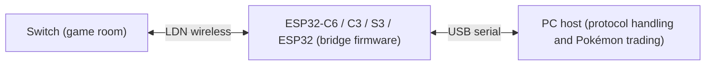

# FRLG Trade Center

English fork of [easyworld/frlg-ldn-trade-esp32](https://github.com/easyworld/frlg-ldn-trade-esp32),
itself a port of [tornadus/frlg-ldn-trade](https://github.com/tornadus/frlg-ldn-trade). It provides a
Windows C# desktop host, a cross-platform console host, and wireless bridge firmware for four ESP32 chips,
each maintained as an independent project. Beyond the translation, this fork adds the ESP32-S3 and
original-ESP32 firmware, the console host, and prebuilt images for all four chips.


*The screenshot shows the original Chinese interface; the fork's interface strings are English.*

https://github.com/user-attachments/assets/484677c5-2db5-4e83-a864-ac67cbc7ce3b

The C# host drives everything over the serial port: device identification, room scanning, LDN
authentication, Pia/RFU communication and the trade itself; PKHeX.Core handles PK3 display and editing.
The firmware handles wireless association, session key installation and data transfer.
Room configuration and Pokémon data are sent over the serial port when connecting.
The PC must keep the host running for the whole connection.



## Supported boards

| Chip | Project | Link to the PC | Default flash | Status |
| --- | --- | --- | --- | --- |
| ESP32-C6 | [`firmware/esp32-c6`](firmware/esp32-c6/README.md) | UART, through the board's USB-to-UART bridge | 16 MB (4/8 MB selectable) | Upstream reference: two real trades, verified joining newly created rooms on different channels. Includes the private raw-TX adapter and TX tracing. Prebuilt image in `firmware/release`. |
| ESP32-C3 | [`firmware/esp32-c3`](firmware/esp32-c3/README.md) | Native USB Serial/JTAG | 4 MB | Upstream experimental: real room entry and one complete trade. Prebuilt image in `firmware/release`. |
| ESP32-S3 | [`firmware/esp32-s3`](firmware/esp32-s3/README.md) | Native USB Serial/JTAG | 8 MB | Port of the C3 project. Validated on an M5Stack AtomS3 with staged diagnostics and a complete trade (2026-09-08). Prebuilt image in `firmware/release`. |
| ESP32 (original) | [`firmware/esp32`](firmware/esp32/README.md) | UART, through the board's USB-to-UART bridge (CP2102 on common devkits) | 4 MB | Port of the S3 project with a UART transport. Validated on an ESP32-D0WD-V3 devkit with staged diagnostics and complete trades (2026-09-08). Prebuilt image in `firmware/release`. |

All four run at 115200 baud after boot and switch to 921600 on request; the two USB Serial/JTAG
chips accept the baud command without changing their physical rate. Every variant is a **joiner**:
the Switch creates the room and is the LDN access point, and the ESP32 associates to it. Hosting a
room from the ESP32 (Leader mode) is not implemented in any firmware or in the host.
The chips share the serial protocol, so the host only checks the protocol version and capabilities;
the chip model is shown for information only. Any other microcontroller would have to implement the
LDN wireless capabilities the protocol requires; a plain serial port is not enough to talk to a Switch.

## Layout

| Directory | Contents |
| --- | --- |
| `host/core` | Pure C# LDN, serial protocol, Pia, RFU and trade state machine |
| `host/desktop` | C# WPF interface, PKHeX editing, party and settings persistence (Windows only) |
| `host/tests` | .NET protocol tests, offline replay, board diagnostics and the [console host](host/tests/README.md) |
| `firmware/esp32-c6` | [ESP32-C6 firmware](firmware/esp32-c6/README.md), UART, with the C6-specific build and audit tools |
| `firmware/esp32-c3` | [ESP32-C3 experimental firmware](firmware/esp32-c3/README.md), native USB Serial/JTAG |
| `firmware/esp32-s3` | [ESP32-S3 firmware](firmware/esp32-s3/README.md), native USB Serial/JTAG |
| `firmware/esp32` | [Original ESP32 firmware](firmware/esp32/README.md), UART |
| `firmware/release` | [Prebuilt full images](firmware/release/README.md) for all four chips, with checksums |
| `firmware/tools` | Shared SDK installation and environment scripts (Windows) and a Windows wireless diagnostic tool |
| `assets/party` | Default MEWTWO and DEOXYS; the programs never modify these files |
| `assets/sprites` | Local Pokémon PNG images, 1–386 |
| `app` | win-x64 framework-dependent single-file EXE (build output) |
| `local` | Standby party, settings, session logs and received PK3 files; do not publish |

## Running and keys

### Windows desktop app

Run `app/Frlg.Trade.Desktop.exe`; it needs the Windows x64 .NET 10 Desktop Runtime.
The default Pokémon and all sprites are embedded, so copying the EXE alone is enough; `assets` and
`project.json` are not needed at run time. The party, settings and session logs are written to
`local/` next to the EXE, so keep it in a writable directory. The port is selected in the interface.

### Console host (Linux, macOS, Windows)

The WPF app is Windows only. Everywhere else, `host/tests` doubles as a console host with the same
protocol code: `--device <port>` runs the board diagnostic, `--live <port>` runs a complete trade
session, and the `--party` commands manage the standby party in `local/party.json`, the same file the
desktop app uses. See [host/tests/README.md](host/tests/README.md).

### prod.keys

`prod.keys` is read on every connection, in a fixed order:

1. The directory containing the executable, i.e. `app/prod.keys` for the desktop app or the build
   output directory for the console host.
2. `.switch/prod.keys` in the current user's home directory.
3. If neither exists, the desktop app prompts for the file to be placed in the program directory,
   with a button to open that directory and retry.

If the higher-priority file exists but is invalid, an error is shown; the other file is not used
silently. Keys are never embedded as resources, copied to the publish directory, or written to the
firmware. The firmware only receives the CCMP key derived for the current session and keeps it in RAM.
The host needs `master_key_00` or `master_key_12` plus `aes_kek_generation_source` and
`aes_key_generation_source`; `title.keys` is not used.

### Trading

Create a FireRed Leader room on the Switch, then connect. Entering the room, choosing the Pokémon and
confirming the trade are still done on the Switch.

In the desktop app, the left and right panels each show six slots in three rows of two. The left side
is empty until connected, shows the partner's party once a complete valid party has arrived, and is
cleared on disconnect. The right side offers the two default Pokémon on first run and restores the saved
standby party afterwards. You can drag in 80- or 100-byte PK3 files, click an empty slot to import,
choose which Pokémon to offer, and right-click a slot to view, export or clear it. A yellow border marks
the offered slot. The party must contain at least two Pokémon. Each connection completes one trade,
after which the Switch cancels and leaves the room.

Connecting can be cancelled. A serial error, a wireless timeout, or the background task ending restores
the Connect button and clears the left side. Disconnecting deliberately ends the session immediately;
there is no automatic reconnection in the middle of a trade. To finish normally, cancel and leave the
room on the Switch.

## Trainer sync and party snapshots

Tick "auto-sync the partner's trainer" or press the sync button. Identities are deduplicated by TID,
SID, name and gender. A single identity is applied directly; with several, the user chooses, and
cancelling changes nothing. Syncing overwrites those four fields on every non-empty slot on the right
and recomputes the checksums; it does not touch the PID, IVs or any other field. A name that cannot be
represented in the target PK3's language makes the whole batch fail and leaves the party unchanged.
Changing the TID/SID can change the Generation 3 shiny determination; this feature is not a legality fix.

A snapshot of the party is taken when a connection starts. Imports, offer-slot changes and trainer sync
made during a connection only modify the standby party, are marked "takes effect on the next connection",
and never replace data already sent to the partner. The standby party is saved to `local/party.json`.
Each received Pokémon is saved at commit time to `local/runs/<timestamp>-native/received.pk3` before
the interface is notified; when standby edits are pending, the result does not overwrite the standby slot.
The console host applies the same rule without the pending-edit exception: the received Pokémon takes
the offered slot, so the next session sends it back.

## Building and flashing

The host only needs the .NET 10 SDK and NuGet network access:

```powershell
.\setup.ps1
```

The script uses the same publish configuration as the Visual Studio `FolderProfile`: Release, win-x64,
framework-dependent (no bundled .NET runtime), single file, output `app/Frlg.Trade.Desktop.exe` with no
separate DLLs or PDBs. On other platforms, `dotnet build host/tests/Frlg.Trade.Tests.csproj -c Release`
builds the console host.

Building and flashing firmware with the scripts below requires the full ESP-IDF toolchain.
`firmware/tools/setup.ps1` installs the toolchains for the C6 and C3 on Windows. On Linux, download the
`esp-idf-v6.1.zip` release archive, verify its SHA-256
`cdeea7db47b90064ef185b2a1f1b33d17bcb13469a9f8cc20e06c4c4cdb4cc16`, extract it to `~/esp/esp-idf-v6.1`,
and run `./install.sh esp32,esp32s3` (or the targets you need) inside it.

The firmware is pinned to **ESP-IDF v6.1, commit `fff9895c82d744c7237be8847347bdd1b07c6643`**.
All chips' LDN bridging uses the private WPA callback table and key installation interface.
The C6 project additionally contains a software-CCMP raw-frame transmit adapter and the driver descriptor
and DMA structure offsets used by its transmit diagnostics. These private ABIs, symbols and memory layouts
are not guaranteed to be compatible across SDK versions, so the SDK cannot simply be swapped.

The install and build scripts verify the SDK commit and the archive SHA-256. Each chip project also pins
the SHA-256 of the closed Wi-Fi driver library it was verified against (`libnet80211.a`; the C6 raw-TX
build also pins `libpp.a`). The C6 transmit adapter extracts object files from the vendor library,
generates a standalone overlay by rewriting the ELF symbol table, and routes selected calls into custom
implementations; it does not modify the installed SDK, and it checks that the machine code of the transmit
and frame-check sections it relies on is unchanged. When upgrading ESP-IDF, re-verify the private
interfaces, callback table layout, library symbols and structure offsets, then pass the link audit,
an over-the-air capture, real-board room entry and a complete trade before updating the version and
hash pins.

ESP32-C6 (Windows scripts; the raw-TX overlay and link audit tooling has only been run on Windows):

```powershell
.\firmware\esp32-c6\tools\probe.ps1 -Action build
.\firmware\esp32-c6\tools\probe.ps1 -Action flash -Port COM6
```

The script defaults to C6, UART, 16 MB, dynamic-session serial firmware. Close the host connection and
any other serial monitor before flashing. The complete trade bridge is `-Mode serial`. Replace the port
with the actual device port; the flash size can be set with `-FlashSize 4MB`, `8MB` or `16MB`.
The serial bridge connects to the PC through the on-board USB-to-UART bridge or an external 3.3 V USB
serial adapter; for an external adapter, cross TX/RX and share ground. The C6's native USB Serial/JTAG
port is only used for diagnostic configurations and cannot replace this project's UART bridge.
The `public`, `discovery` and `send` modes are reserved for wireless diagnostics and do not provide the
trade bridge.

ESP32-C3:

```powershell
.\firmware\esp32-c3\tools\probe.ps1 -Action build
.\firmware\esp32-c3\tools\probe.ps1 -Action flash -Port COM5
```

The C3 defaults to 4 MB flash and connects to the PC through its native USB Serial/JTAG port; see the
[C3 project notes](firmware/esp32-c3/README.md).

ESP32-S3 and original ESP32 (Linux scripts shown; `probe.ps1` in the same directories does the same on Windows):

```bash
firmware/esp32-s3/tools/probe.sh build
firmware/esp32-s3/tools/probe.sh flash /dev/ttyACM0
firmware/esp32/tools/probe.sh build
firmware/esp32/tools/probe.sh flash /dev/ttyUSB0
```

Each project's build output stays in its own `build*` directory and is ignored by git. The prebuilt
images for all four chips in [`firmware/release`](firmware/release/README.md) flash with esptool at offset
`0x0`; pass `--flash-size detect` so the image header matches the board's actual flash size.

## Verification and porting

```powershell
dotnet run --project host/tests/Frlg.Trade.Tests.csproj -c Release
.\app\Frlg.Trade.Desktop.exe --smoke-test
# Close the GUI connection first; the following check clears the device session
dotnet run --project host/tests/Frlg.Trade.Tests.csproj -c Release -- --device COM6
```

The protocol tests use synthetic key vectors shipped with the source. The private trade replay runs in
addition when it is present and is explicitly reported as skipped otherwise. The WPF self-test renders
images into `local/ui-checks` next to the EXE and restores the real party and settings afterwards.

The S3 and original ESP32 projects add a staged hardware diagnostic (`tools/diagnose.sh` or
`diagnose.ps1`) with `serial`, `auth`, `pia` and `room` modes, from the protocol handshake up to actual
room entry against a Switch Leader room.

Validation so far: the C6 has completed two real trades and been verified joining newly created rooms
on different channels; the C3 has completed real room entry and one complete trade; the S3 and the
original ESP32 have completed real trades through the console host. Third-party device implementations
should follow the [serial protocol](docs/SERIAL_PROTOCOL.md).

## License and data

The project license is in the root `LICENSE` (AGPL-3.0); the GPL-3.0 license of the LDN protocol
components is in `licenses/LDN-GPL-3.0.txt`. PKHeX.Core is pinned to 26.8.26 and dependencies are
locked by `packages.lock.json`. Image sources are listed in `assets/README.md`. The default PK3 files
come from user-provided data; remove them before sharing if needed. `local`, `prod.keys`, `title.keys`
and build outputs are ignored by git.
