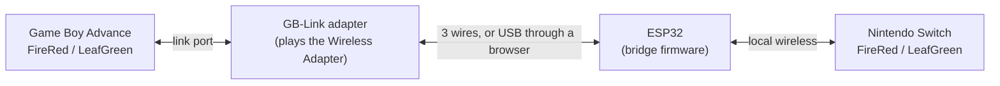

# GB-Link Switch LDN

Link a real Game Boy Advance to Pokémon FireRed and LeafGreen on Nintendo Switch.
The GBA joins the Switch's Trade Center or Colosseum as if the Switch were another GBA
with a Wireless Adapter, and trades and single battles work.

An ESP32 joins the Switch's local-wireless (LDN) room and speaks the Switch's session
protocol. A [GB-Link](https://github.com/GB-Link/GBLink-Firmware) adapter on the GBA's
link port plays the Wireless Adapter. The two boards talk over three wires, with no
computer involved, or over USB with a web page carrying the traffic between them.

This is a fork of [easyworld/frlg-ldn-trade-esp32](https://github.com/easyworld/frlg-ldn-trade-esp32),
itself a port of [tornadus/frlg-ldn-trade](https://github.com/tornadus/frlg-ldn-trade).
Upstream trades with the Switch from a PC that plays the other game; that still works
and is described in [`host/`](host/README.md). This fork adds the firmware that runs the
session on the chip for a real GBA, the GB-Link side of it, and the web client.

## What you need

- An ESP32 board. The ESP32-S3 is the one this has been played on; the others build from
  the same source and await testing.

  | Chip | Computer connection | Status |
  | --- | --- | --- |
  | ESP32-S3 | native USB | trades and single battles, wired and through the browser |
  | ESP32-C6 | native USB | builds; an earlier revision traded, with weaker reception than the S3 |
  | ESP32-C3 | native USB | builds; not yet played on |
  | ESP32 (original) | USB-to-UART bridge, 921600 baud | starts, sets up and carries the link from the web client; not yet played on |

- A GB-Link adapter with the firmware that has the wireless adapter mode. The web
  client installs it.
- A Nintendo Switch with FireRed or LeafGreen, and that console's `prod.keys`: the
  Switch encrypts its local wireless with keys from the console, and the bridge needs
  four of them.
- A Game Boy Advance with FireRed or LeafGreen.

## Setting up

Everything is done from the [web client](web/README.md), in Chrome or Edge on a computer:

1. Serve the `web/` folder (`python3 -m http.server -d web 8000`, then
   <http://localhost:8000>), or open wherever it is hosted.
2. **ESP32 board**: plug the ESP32 in, install the firmware, and drop your `prod.keys`
   on the page. The file is read in the browser; four values go to the board over USB
   and nothing is uploaded.
3. **GB-Link adapter**: plug it in and install the wireless firmware.
4. **Play**: either join the boards with three wires (the page shows the pins) and
   power them from anything, or leave both on USB and let the page carry the link.

Then, on the Switch, go upstairs in a Pokémon Center to the Direct Corner, choose the
Trade Center or the Colosseum and become the group leader. On the GBA, with the adapter
plugged in, choose the same activity and join the group; the Switch player is listed
after a few seconds. After you leave the room the bridge restarts and is ready for the
next one about ten seconds later.

## Repository layout

| Directory | Contents |
| --- | --- |
| [`web`](web/README.md) | The web client: installs both firmwares, stores the keys, carries the link over USB |
| [`firmware`](firmware/README.md) | Bridge firmware: one source tree (`common/`) built for four chips, plus build and test tools |
| `firmware/old` | The radio-only firmware from before this rework, with its prebuilt images. Nothing here uses it any more |
| [`host`](host/README.md) | C# desktop app (Windows and Linux) and console host: trading from a PC without a GBA, on the same firmware |
| [`docs/SERIAL_PROTOCOL.md`](docs/SERIAL_PROTOCOL.md) | The console protocol both firmwares speak |
| `assets` | Default Pokémon and sprites for the PC hosts |
| `app`, `local` | Build output and local data of the PC hosts; not published |

## Building

The web client installs prebuilt firmware, so nothing needs building to play.
[`firmware/README.md`](firmware/README.md) covers building the bridge firmware (pinned
ESP-IDF v6.1) and how a session runs; `firmware/tools/package_web.py` refreshes the
images the web client installs. [`host/README.md`](host/README.md) covers the PC hosts.
The adapter firmware is the [GB-Link firmware](https://github.com/GB-Link/GBLink-Firmware).

## Licence

AGPL-3.0, see `LICENSE`; the LDN protocol components are GPL-3.0
(`licenses/LDN-GPL-3.0.txt`). The web client bundles
[esptool-js](https://github.com/espressif/esptool-js) (Apache-2.0) and
[picoflash](https://github.com/picoflash/picoflash) (MIT). PKHeX.Core, used by the PC
hosts, is pinned to 26.8.26. `local`, `prod.keys`, `title.keys` and build outputs are
ignored by git. Not affiliated with Nintendo or The Pokémon Company.
