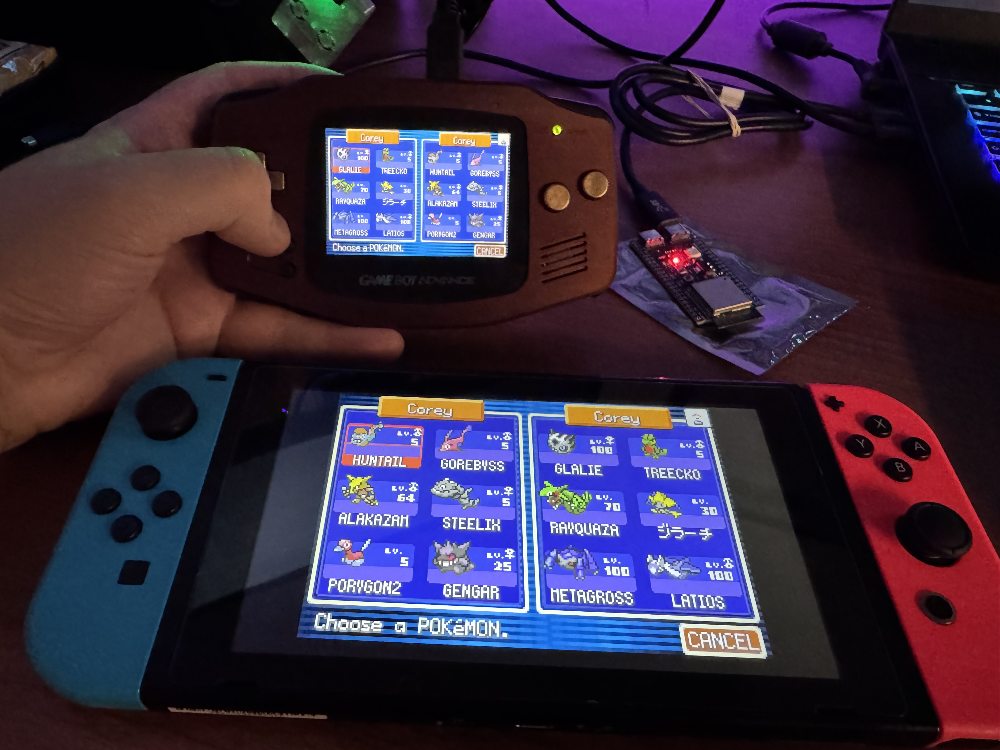
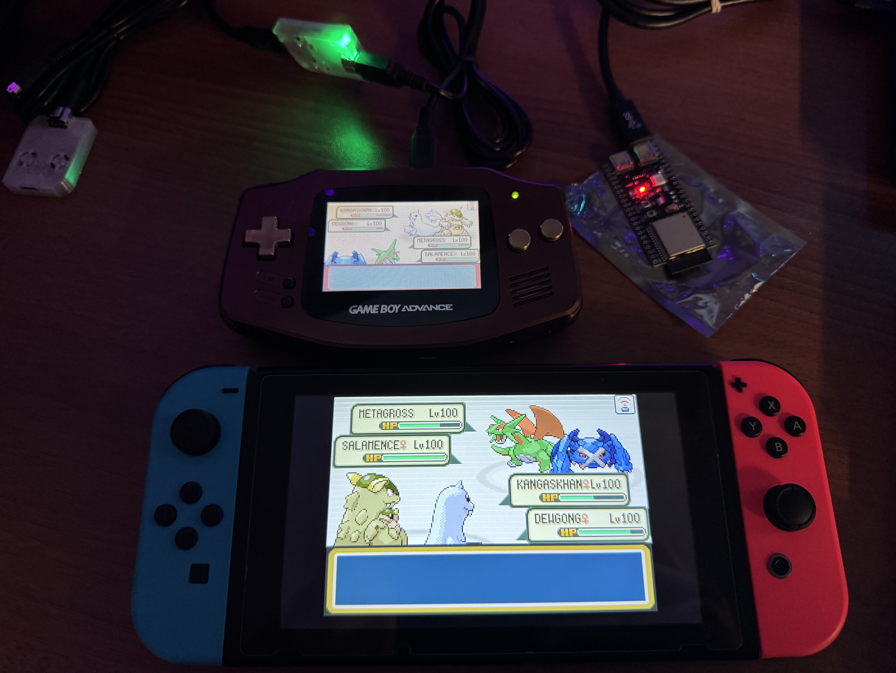
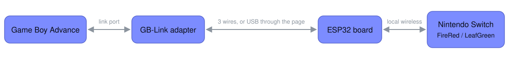
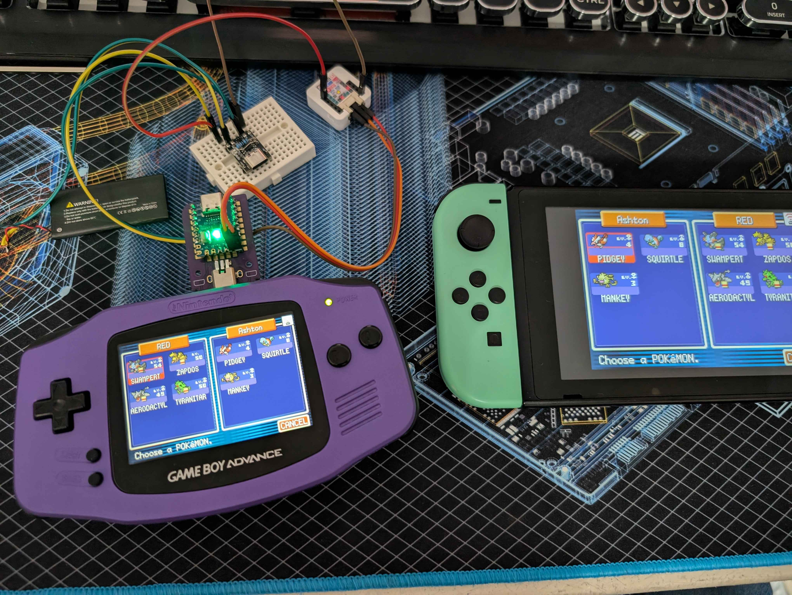

# GB-Link Switch LDN

Trade and battle with Pokémon FireRed and LeafGreen on the Nintendo Switch, from a real
Game Boy Advance or from your PC.

- **GBA to Switch.** A GBA running FireRed, LeafGreen or Emerald joins the Switch's
  Trade Center or Colosseum over the Switch's own local wireless, as if it were another
  Switch. Trades and battles.
- **PC to Switch.** No GBA needed: trade with the Switch from the web page, from an
  online Wonder Trade pool or from your own `.pk3` files.

Everything is set up and played from **<https://switch.gblink.io>**.

|  |  |
| --- | --- |
| Trading | Battling |

Emerald on a GBA against FireRed on a Switch. Photos by AngeloftheNight091.

## How it works

The Switch's local wireless is a Wi-Fi network. An ESP32 board joins it the way a
second Switch would. On the GBA side, a [GB-Link](https://github.com/GB-Link/GBLink-Firmware)
adapter in the link port stands in for the Wireless Adapter. The two boards are
connected with three wires, or both go on USB and the web page passes the traffic
between them.

Standalone: the GB-Link in the link port, three wires to the ESP32, a battery, and no
computer.

## What you need

**GBA to Switch** needs an ESP32 board and a GB-Link adapter. **PC to Switch** needs
only the ESP32 board.

- An ESP32 board. The original ESP32 and the ESP32-S3 are the recommended ones.

  | Chip | Connects over |
  | --- | --- |
  | ESP32 (original) | USB-to-UART chip, 921600 baud |
  | ESP32-S3 | native USB |
  | ESP32-C6 | native USB |
  | ESP32-C3 | native USB |

- A Switch with FireRed or LeafGreen, and the `prod.keys` file from your Switch. The
  wireless is encrypted with keys from the console, so the board needs four of them.
  The page reads the file and sends those four values to the board over USB. Nothing is
  uploaded anywhere.
- For GBA to Switch: a GB-Link adapter and a GBA with FireRed, LeafGreen or Emerald.
  The page installs the adapter's firmware, from
  <https://github.com/GB-Link/GBLink-Firmware>. Emerald can trade once the Switch's game is
  far enough along to link with Ruby, Sapphire and Emerald (Celio's machine on One
  Island fixed), the same rule as between two GBAs.

## Setting up

Open the web client in Chrome or Edge on a computer. Phones and Safari cannot reach the
boards.

1. **ESP32 board.** Plug it in, press *Install firmware*, then drop your `prod.keys` on
   the page.
2. **GB-Link adapter.** Plug it in and install the wireless firmware. Skip this for
   PC to Switch.
3. **Play.** Connect the boards with three wires (the page shows which pins) and power
   them from anything, or leave both on USB and press *Start* so the page carries the
   link.

On the Switch, go upstairs in a Pokémon Center to the Direct Corner, pick Trade Center
or Colosseum and become the leader. On the GBA, pick the same thing and join the group.
The Switch shows up after a few seconds. When you leave the room the board restarts and
is ready again about ten seconds later.

### PC to Switch

Pick it at the top of the page, or open <https://switch.gblink.io/#switch>. Host a
Trade Center room on the Switch, press *Connect*, accept the join on the Switch and sit
down at the table.

- **Wonder Trade.** The pool picks the Pokémon you get, and what the Switch gives goes
  into the pool for the next person. <https://pokemon.gblink.io/pool> shows what is in
  it. Leave the table and sit down again for a different one.
- **PK3 files.** Your own party, kept in the browser. Pokémon go in and out as `.pk3`
  files, and what the Switch sends takes the place of what you gave.

Keep the tab in view while you trade; a hidden tab runs too slowly for the game.

The desktop app in [`host/`](host/README.md) trades from a party of your own on Windows
and Linux.

## Repository layout

| Directory | Contents |
| --- | --- |
| [`web`](web/README.md) | The web client: installs both firmwares, stores the keys, carries the link over USB, trades by itself |
| [`firmware`](firmware/README.md) | The ESP32 firmware, one source tree built for four chips, with build and test tools |
| [`host`](host/README.md) | The desktop app and the console tools, in C# |

## Building

The web client installs prebuilt firmware, so nothing needs building to play.
[`firmware/README.md`](firmware/README.md) covers building the ESP32 firmware with the
pinned ESP-IDF v6.1 and how a session runs; `firmware/tools/package_web.py` refreshes the
images the page installs. [`host/README.md`](host/README.md) covers the desktop app. The
adapter firmware comes from [GBLink-Firmware](https://github.com/GB-Link/GBLink-Firmware).

## Credits

The ESP32's LDN code started from [easyworld/frlg-ldn-trade-esp32](https://github.com/easyworld/frlg-ldn-trade-esp32),
a port of [tornadus/frlg-ldn-trade](https://github.com/tornadus/frlg-ldn-trade). Photos by
AngeloftheNight091. Pokémon pictures on the page come from [PokeAPI](https://github.com/PokeAPI/sprites).

## Licence

AGPL-3.0, see `LICENSE`. The LDN protocol components are GPL-3.0
(`licenses/LDN-GPL-3.0.txt`). The web client bundles
[esptool-js](https://github.com/espressif/esptool-js) (Apache-2.0) and
[picoflash](https://github.com/picoflash/picoflash) (MIT). `local`, `prod.keys`,
`title.keys` and build outputs are ignored by git. Not affiliated with Nintendo or The
Pokémon Company.
