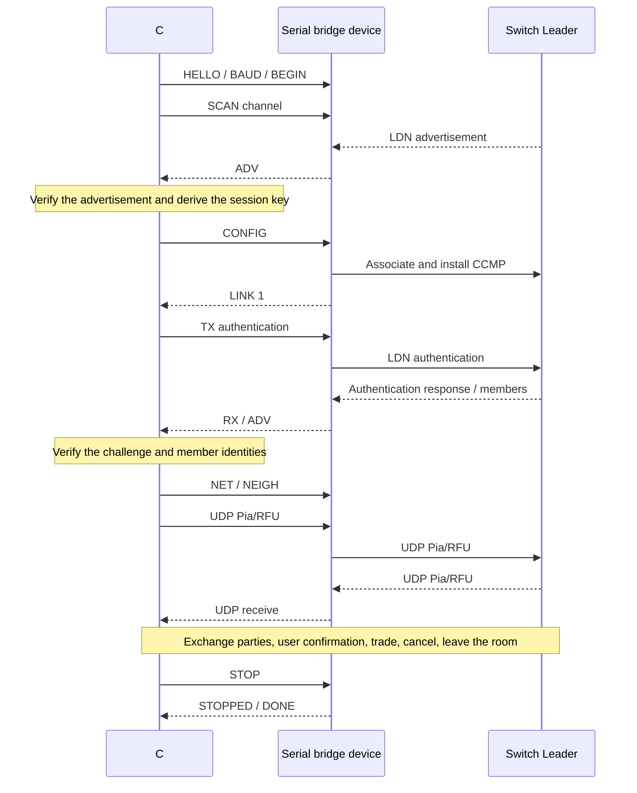

# FRLG Serial Bridge Protocol v1

This specification defines the protocol between the C# host and the wireless bridge device. The device
model plays no part in compatibility decisions. The version 1 reference implementations are in
`firmware/esp32-c6/main/` and `firmware/esp32-c3/main/` (`ldn_wire.c`, `ldn_control.c`, `ldn_udp.c`), with
the `firmware/esp32-s3/main/` and `firmware/esp32/main/` ports derived from the C3 implementation;
the host implementation is in `host/core/SerialProtocol.cs` and `host/core/TradeSession.cs`.
Paths in this document are relative to the repository root.

## Responsibilities and porting requirements

The host holds prod.keys, decrypts and verifies advertisements, derives the session key, and runs LDN
authentication, Pia, RFU and the trade state machine. The device receives the derived CCMP key for the
current room and handles 802.11 association, key installation and network transfer. The device does not
parse PK3 data and never holds prod.keys. Changing Pokémon or rooms does not require a firmware update.

Another device must implement the following capabilities, not merely offer a serial port:

- Listen for Nintendo LDN vendor action broadcasts on a given channel and report the encrypted content
  verbatim together with the sender BSSID.
- Associate with the room, supporting the RSN/CCMP path LDN uses, and install the pairwise and group
  session keys.
- Send and receive LDN authentication frames with EtherType 0x88B7.
- Configure a static 169.254.x.x/24 address, neighbor mappings and UDP port 12345, with a maximum UDP
  payload of 1472 bytes.
- Handle CCMP replay protection, re-association, disconnect notification and session cleanup correctly.

The reference C6 adapter uses private interfaces of the pinned ESP-IDF v6.1. Other chips may implement the
same capabilities with their own drivers; there is no need to copy the C6's private ABI, hardware tracing,
flash commands or reset-pin handling.

## Serial link and handshake

The C6 UART uses 8 data bits, no parity, 1 stop bit and no hardware flow control. It boots at 115200 baud
and runs at 921600. The C3 uses native USB Serial/JTAG and accepts the same baud command, but the setting
does not change the physical USB transfer rate. Opening the port must not toggle DTR/RTS deliberately and
must not require a chip-specific reset sequence.

A freshly started device may print ordinary boot logs. The host sends ASCII `\nLDN_BINARY\n` followed by a
single 0x00 byte, which puts the device into binary mode and lets the receiver find a frame boundary, and
then sends the binary `LDN_HELLO` command. A device already in binary mode discards the invalid boot text in
front and processes the valid frames that follow. The host may try 115200 and then 921600 in turn to reopen a
device that was left at the other rate.

Example HELLO response: `LDN_HELLO 1 esp32c6 dynamic-session,scan,auth,udp 1472`. The fields are the
version, the model, the comma-separated capabilities and the MTU. The model is only for display and
diagnostics. The host must check the version and the required capabilities; it must not send a dynamic
configuration to old firmware and assume success.

## Frame structure

Each raw frame is COBS-encoded and followed by one 0x00 delimiter. The COBS-encoded region contains no
0x00. The receiver must cope with partial frames, several frames in one read, noise and overlong frames;
after an error it discards data up to the next 0x00 and resynchronizes.

| Raw frame offset | Length | Content |
| --- | --- | --- |
| 0 | 1 | Protocol version, fixed 1 |
| 1 | 1 | Message type |
| 2 | 4 | request_id, little-endian |
| 6 | 4 | session_id, little-endian |
| 10 | 2 | payload length, little-endian |
| 12 | N | payload |
| 12+N | 4 | CRC-32/ISO-HDLC, little-endian |

The CRC covers the first 12+N bytes; reflected polynomial 0xEDB88320, initial value and final XOR both
0xFFFFFFFF. A raw frame is at most 4096 bytes and the payload at most 4080 bytes. Frames whose checksum,
length or version does not match must not be executed. The reference firmware's ASCII command limit is
3015 bytes, and every command in the version 1 command table must stay within it. COBS is a framing
encoding and the CRC detects transmission errors; neither is encryption or authentication.

| Type | Direction | payload |
| --- | --- | --- |
| 1 | host → device | ASCII control command, no NUL, CR or LF |
| 2 | device → host | Request response, ASCII, no line breaks |
| 3 | device → host | Asynchronous status or broadcast, ASCII, no line breaks |
| 4 | host → device | 4 network-order bytes of the destination IPv4 + raw UDP payload |
| 5 | device → host | 4 network-order bytes of the source IPv4 + raw UDP payload |

UDP payloads are not hex-encoded. A UDP payload is at most 1476 bytes (4+1472). The IPv4 byte order does
not follow the header's little-endian rule.

## Requests and sessions

Control requests use a non-zero request_id. Every direct response carries that id, and the last response
is `LDN_DONE`. Receiving `_RESULT 0` or another response first does not mean the request has completed;
the host must read up to DONE. Asynchronous events use request_id=0; UDP sends use request_id=0 and are
not acknowledged per packet on success. DONE only means that command processing has ended; for example,
CONFIG's association still has to be awaited through the LINK event.

The host generates a new non-zero session_id for each connection and sends `LDN_BEGIN <8 hex digits>`.
BEGIN stops the previous connection, clears the old receive queue and switches the session_id. The
response to that request uses the new session_id. HELLO and BEGIN are cross-session entry points; every
other request's session_id must equal the device's current value or the request is rejected. The host
discards late events from other sessions. At power-up session_id=0; after a device reboot the handshake
and BEGIN must be repeated.

Version 1 control requests execute serially, with at most one request outstanding at a time. Commands with
side effects are not resent automatically; after a timeout the current connection ends and recovery goes
through a new BEGIN. request_id matches responses to requests and carries no persistent de-duplication
semantics. The device must not interpret a repeated request id as a new reliable-transport sequence
number, and the host must increment the id within a connection.

## Command table

| Command | Arguments | Response or effect |
| --- | --- | --- |
| `LDN_HELLO` | none | HELLO version/capability line, DONE |
| `LDN_BEGIN` | 8-hex-digit session_id | Clean up the old session, `LDN_BEGUN`, DONE |
| `LDN_BAUD` | 115200 or 921600 | `LDN_BAUD_READY <baud>` and DONE are sent at the old rate, then the rate switches |
| `LDN_SCAN` | channel, 1..11 in the reference implementation | Switches channel while idle, `LDN_SCAN_RESULT <code>` |
| `LDN_CONFIG` | channel, SSID, BSSID, derived key | `LDN_CONFIG_RESULT <code>`, then asynchronous association |
| `LDN_STATUS` | none | SESSION, LINK, diagnostic counters, DONE |
| `LDN_TX` | authentication payload in hex | `LDN_TX_RESULT <code>` |
| `LDN_NET` | local IPv4, Leader IPv4 | Configure the /24 address and UDP socket, `LDN_NET_RESULT <code>` |
| `LDN_NEIGH` | IPv4, 12-hex-digit MAC | Add or replace a static neighbor, `LDN_NEIGH_RESULT <code>` |
| `LDN_FORGET` | IPv4 | Remove a neighbor, `LDN_NEIGH_RESULT <code>` |
| `LDN_PING` | none | `LDN_PONG <tx> <rx> <rejected>` |
| `LDN_STOP` | none | Stop networking, clear keys and queues, `LDN_STOPPED` |

CONFIG argument format:

```text
LDN_CONFIG <channel> <ssid32hex> <bssid-colon-separated> <ccmp32hex>
```

The SSID argument is the hex string of LDN's 16-byte identifier. The wireless SSID is those 32 ASCII
characters; do not mistake them for 16 raw binary SSID bytes. The BSSID is a 6-byte unicast MAC. The CCMP
key is 16 bytes. The configuration is validated completely before it is applied, and the arguments stay in
RAM. The key must never be echoed, written to ordinary diagnostic logs, or saved to flash by default.

## Events and errors

| Event | Meaning |
| --- | --- |
| `LDN_ADV <bssid> <channel> <hex>` | Complete encrypted advertisement; the host must verify it before using it |
| `LDN_LINK <0 or 1> <local MAC>` | Wireless link change; LINK 1 does not mean LDN authentication is complete |
| `LDN_RX <sourceMAC> <hex>` | Authentication payload of EtherType 0x88B7, without the Ethernet header |
| `LDN_NET_LOST` | The link failed or the host heartbeat was lost; the device has stopped UDP |
| `LDN_UDP_ERROR <code>` | A UDP send failed and must not be treated as sent |
| `LDN_ERROR <reason>` | For example STALE_SESSION, INVALID_SESSION, ASSOCIATION_TIMEOUT |

`_RESULT 0` means success and any other value means failure. The specific non-zero values in v1 are
reserved as implementation-specific diagnostics; the host does not depend on ESP-IDF error codes and only
distinguishes success from failure. Unknown capabilities and diagnostic fields may be ignored; an
unsupported version or a missing required capability must stop the connection; unknown frame types are not
executed, and the current host ignores unknown extension events.

The reference host's default control-request timeout is 3 seconds; BEGIN and CONFIG use 8 seconds; device
identification allows 2 seconds per baud rate. Scanning takes about 25 seconds in total with 500 ms per
channel; authentication takes 40 seconds in total with at most three authentication requests 700 ms apart.
Those are LDN-level retries of the same authentication, not repeated serial CONFIG commands.

## Flow and recovery

The host sends PING every second and waits up to 5 seconds for PONG; while UDP is active, the device
releases the connection after more than 10 seconds without a PING. The host treats more than 30 seconds
without a valid host Pia packet as loss of contact. The normal CLOSE handshake allows 1.5 seconds for the
trailing replies.

v1 uses no per-byte flow control and no serial-level UDP retransmission; reliability comes from the Pia
selective-repeat layer. The reference host's reliable send window is at most 6 frames, driven at about
59.727 Hz, sending at most 9 Pia messages per batch, at most 3 K acknowledgements per step with at most 3
K outstanding, and new T packets limited by the host's polling credit. The C6 UART RX buffer is 32768 bytes
and its TX buffer 4096 bytes; the C3 USB RX buffer is 32768 bytes and its TX buffer 8192 bytes. Both
reference firmwares report at most 2 UDP packets per poll round; other devices must provide equivalent
throughput and buffering and must not silently drop control commands they have already acknowledged.

A single corrupt frame is discarded and counted, and synchronization continues. Queue overflow, an unplugged
serial port, a request timeout caused by CRC errors, or a heartbeat or request timeout after a device
reboot all end the current session, release the serial port and restore the interface state. There is no
automatic reconnection or replacement of an already-sent party in the middle of a trade. A normal end is
driven by the Switch cancelling and leaving the room.

## Normal sequence



## Porting acceptance

1. COBS/CRC tests: empty frame, maximum frame, split and coalesced frames, noise recovery, wrong lengths.
2. HELLO, rate switch, BEGIN, rejection of a wrong session, repeated reopening of the serial port.
3. Scan several channels and verify that real advertisements are reported with the matching channel.
4. Switch to a newly created room without reflashing; reconnecting to the same room must not reuse a wrong
   CCMP replay state.
5. LDN challenge verification, member address verification, a complete party exchange and PK3 verification.
6. A real trade, results written to disk, cancellation and a normal exit, then state recovery after
   unplugging the cable or losing the wireless link.

Automated reference: the C# tests in `host/tests`. `host/tests/fixtures/vectors.json` provides fixed protocol
vectors with synthetic keys; real captures and the optional trade replay stay in `local/` only.
