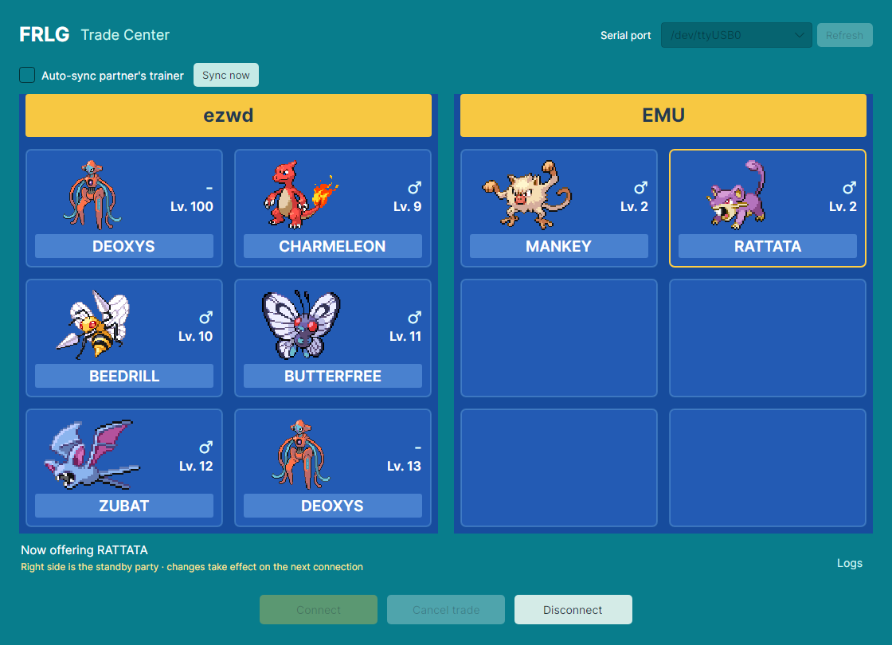
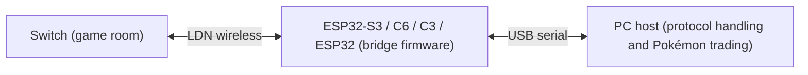

# Desktop and console hosts

Trading with the Switch from a PC, with no Game Boy Advance involved. Based on
[easyworld/frlg-ldn-trade-esp32](https://github.com/easyworld/frlg-ldn-trade-esp32),
itself a port of [tornadus/frlg-ldn-trade](https://github.com/tornadus/frlg-ldn-trade),
translated to English here.



The C# host drives everything over the serial port: device identification, room scanning, LDN
authentication, Pia/RFU communication and the trade itself; PKHeX.Core handles PK3 display and editing.
The firmware handles wireless association, session key installation and data transfer.
Room configuration and Pokémon data are sent over the serial port when connecting.
The PC must keep the host running for the whole connection.



**Which firmware.** The hosts use the current bridge firmware, 2.0 or later: the one the
[web client](../web/README.md) installs. That firmware looks for a room and bridges a Game Boy
Advance on its own, and keeps the radio to itself while it does. A host asks it to rest for the
length of its session (`LDN_BRIDGE_STOP`) and starts it again when it is done
(`LDN_BRIDGE_START`), so one board serves both uses. A board with firmware from before 2.0 is
refused with a note to install the current one. The keys stay on the PC for these hosts;
nothing needs to be stored on the board.

## Supported boards

Any board the bridge firmware runs on: ESP32-S3, ESP32-C6, ESP32-C3 and the original ESP32, as
listed in [`firmware/README.md`](../firmware/README.md). A UART console (the original ESP32
behind its USB-to-UART chip) runs at 921600 baud from its first line, and the hosts open every
port at that rate; a chip's own USB port ignores it. Opening the port resets the chip on some
systems, so the handshake keeps asking for up to eight seconds while it starts.

Every board is a **joiner**: the Switch creates the room and is the LDN access point, and the
ESP32 associates to it. Hosting a room from the ESP32 (Leader mode) is not implemented. The host
checks the protocol version, the capabilities and the firmware version; the chip model is shown
for information only.

## Running and keys

### Desktop app (Windows and Linux)

One program for both systems, built on [Avalonia](https://avaloniaui.net).

- **Windows:** run `app/Frlg.Trade.Desktop.exe`. It needs the .NET 10 runtime for x64 (the plain
  runtime, not the Windows Desktop Runtime).
- **Linux:** run `app/FRLG_Trade_Center-x86_64.AppImage`. It carries its own .NET runtime, so
  nothing has to be installed beyond what a desktop system has (X11 or XWayland, fontconfig, ICU).
  Your user needs access to serial ports: the `dialout` group on Fedora, Debian and Ubuntu, `uucp`
  on Arch.

The default Pokémon are embedded, so copying the one file is enough; `assets` and
`project.json` are not needed at run time. The program ships no artwork: each Pokémon's picture is
downloaded from the [PokeAPI sprite collection](https://github.com/PokeAPI/sprites) the first time
it is shown and kept in `local/sprites`, so a picture that has been seen once also shows without a
network, and one that has not is simply left out. The party, settings and session logs are written to
`local/` next to the program, so keep it in a writable directory. An AppImage runs from a read-only
mount, so for it "next to the program" means next to the AppImage file, for `local/` and for
`prod.keys` alike. The port is selected in the interface. On Linux the list leaves out the machine's
built-in `ttyS` entries and the GB-Link adapter's own serial port, neither of which is ever the
board.

### Console host

`host/tests` doubles as a console host with the same protocol code, for machines without a
desktop: `--device <port>` runs the board diagnostic, `--live <port>` runs a complete trade
session, and the `--party` commands manage the standby party in `local/party.json`, the same
file the desktop app uses. See [host/tests/README.md](tests/README.md).

### prod.keys

The keys are not part of the program: the published builds contain none and work for everyone as
they are, so nobody has to build the program to use their own. `prod.keys` is read on every
connection, in a fixed order:

1. The directory containing the program, i.e. `app/prod.keys` for the desktop app (next to the
   AppImage file on Linux) or the build output directory for the console host.
2. `.switch/prod.keys` in the current user's home directory.
3. If neither exists, the desktop app asks for the file, when it starts and again when connecting:
   drop your `prod.keys` on the dialog or on the main window, or choose it. The file is checked, and
   the entries the host uses are kept in a `prod.keys` next to the program, readable by your user
   alone. The rest of the file, which opens everything else on the console, is not copied.

If the higher-priority file exists but is invalid, an error is shown; the other file is not used
silently. Keys are never embedded as resources, copied to the publish directory, or written to the
firmware. The firmware only receives the CCMP key derived for the current session and keeps it in RAM.
The host needs `master_key_00` or `master_key_12` plus `aes_kek_generation_source` and
`aes_key_generation_source`; `title.keys` is not used.

### Trading

Create a FireRed Leader room on the Switch, then connect. Entering the room, choosing the Pokémon and
confirming the trade are still done on the Switch.

In the desktop app, the left and right panels each show six slots in three rows of two. The left side
is empty until connected, shows the partner's party once a complete valid party has arrived, and is
cleared on disconnect. The right side starts with the built-in party (`assets/party.json`) on first run
and restores the saved standby party afterwards. You can drag in 80- or 100-byte PK3 files, click an empty slot to import,
choose which Pokémon to offer, and right-click a slot to view, export or clear it. A yellow border marks
the offered slot. The party must contain at least two Pokémon.

The PC offers its Pokémon as soon as the trade menu opens. Clicking another Pokémon while connected
offers that one at once: an offer sent after an earlier one replaces it on the Switch, until the player
there has chosen too. From then on the trade on the Switch's screen is the one that runs, and a later
click applies to the next trade.

The game only leaves the trade menu when both sides choose CANCEL. To back out without trading, click
*Cancel trade* in the desktop app and then choose CANCEL on the Switch. Cancelling on the Switch alone
works too, in two steps: the first CANCEL is answered with "Your friend wants to trade POKéMON", the PC
then cancels as well, and the second CANCEL leaves. A Pokémon chosen on the Switch after that brings the
PC's offer back, and a No to the confirmation is not taken as a wish to leave: it returns to the menu
with the offer standing. The console host follows the Switch in the same way.

After a trade, the Pokémon that came from the Switch takes the place of the one that went, on the right
side and in the party the Switch sees, and it is on offer as soon as the menu opens again. Choosing a
Pokémon on the Switch therefore trades on without reconnecting, trading the same one back included; click
another Pokémon in the app first to offer that instead. Leaving works as it does before a trade: *Cancel
trade* and one CANCEL on the Switch, or two CANCELs there.

Connecting can be cancelled. A serial error, a wireless timeout, or the background task ending restores
the Connect button and clears the left side. Disconnecting deliberately ends the session immediately;
there is no automatic reconnection in the middle of a trade. To finish normally, cancel and leave the
room on the Switch.

## Trainer sync and party snapshots

Tick "auto-sync the partner's trainer" or press the sync button. Identities are deduplicated by TID,
SID, name and gender. A single identity is applied directly; with several, the user chooses, and
cancelling changes nothing. Syncing overwrites those four fields on every non-empty slot on the right
and recomputes the checksums; it does not touch the PID, IVs or any other field. A name that cannot be
represented in the target PK3's language makes the whole batch fail and leaves the party unchanged.
Changing the TID/SID can change the Generation 3 shiny determination; this feature is not a legality fix.

A snapshot of the party is taken when a connection starts. Imports and trainer sync made during a
connection only modify the standby party, are marked "takes effect on the next connection", and never
replace data already sent to the partner. Choosing another slot to offer applies at once, as long as the
slot still holds what the Switch was sent; a slot that was imported or edited since is only known to the
app, and choosing it waits for the next connection like the edit itself. The standby party is saved to
`local/party.json`. Each received Pokémon is saved at commit time to
`local/runs/<timestamp>-native/received.pk3` (`received-2.pk3` and so on for further trades in the same
connection) before the interface is notified. It then takes the traded slot of the standby party too,
unless that very slot was given something else during the connection; in that case it stays in the
session's folder only, and the status line says so. The console host applies the same rule without the
pending-edit exception: the received Pokémon takes the offered slot, so the next session sends it back.

## Building

The hosts need the .NET 10 SDK and NuGet network access:

```
.\setup.ps1    # Windows: app/Frlg.Trade.Desktop.exe
./setup.sh     # Linux:   app/FRLG_Trade_Center-x86_64.AppImage
```

Both publish the same project, Release and x64. The Windows program is framework-dependent (no
bundled .NET runtime) and one file with no separate DLLs or PDBs. The Linux program is published
with its runtime and packed into an AppImage, which is the one file there; `setup.sh` also needs
`curl`, and fetches the two pieces of the [AppImage](https://appimage.org) project that make the
file (the packer, `appimagetool` 1.9.1, and the runtime at the front of every AppImage,
`20251108`) into `local/tools/`, checking each against a SHA-256 written in the script. What the
two configurations share is declared in the project file, so that one `packages.lock.json` serves
both scripts, which restore in locked mode. The Windows profile (`FolderProfile`) also builds on
Linux. `dotnet build host/tests/Frlg.Trade.Tests.csproj -c Release` builds
the console host.

The firmware comes from the [web client](../web/README.md), which installs prebuilt images, or
from a build as described in [`firmware/README.md`](../firmware/README.md). The radio-only
firmware under `firmware/old` is no longer used by these hosts.

## Verification and porting

```
dotnet run --project host/tests/Frlg.Trade.Tests.csproj -c Release
app/FRLG_Trade_Center-x86_64.AppImage --smoke-test   # .\app\Frlg.Trade.Desktop.exe on Windows
# Close the GUI connection first; the following check takes the board over while it runs
dotnet run --project host/tests/Frlg.Trade.Tests.csproj -c Release -- --device /dev/ttyACM0
```

The protocol tests use synthetic key vectors shipped with the source, and run the handshake
against a stand-in for the firmware's console: a board that is still starting, firmware from
before 2.0, a port where nothing answers, and the radio being taken and given back. The private
trade replay runs in addition when it is present and is explicitly reported as skipped otherwise.
The desktop self-test draws off screen, so it needs no display; it renders images into
`local/ui-checks` next to the program and restores the real party and settings afterwards. It
draws its own Pokémon pictures and keeps them there too, so it uses neither the network nor
`local/sprites`.

Validation so far: the board diagnostic passes against firmware 2.0 on an original ESP32
(2026-09-19). A complete trade through these hosts on firmware 2.0 has not been run yet; the
trades recorded upstream and in this fork (C6, C3, S3 and the original ESP32) were made with the
radio-only firmware that 2.0 descends from. Third-party device implementations should follow the
[serial protocol](../docs/SERIAL_PROTOCOL.md).

## License and data

The project license is in the root `LICENSE` (AGPL-3.0); the GPL-3.0 license of the LDN protocol
components is in `licenses/LDN-GPL-3.0.txt`. PKHeX.Core is pinned to 26.8.26 and dependencies are
locked by `packages.lock.json`. The interface uses Avalonia (MIT). Image sources are listed in
`assets/README.md`. The built-in party in `assets/party.json` is user-provided data, the original
trainer's name and IDs included; replace it before sharing if needed. `local`, `prod.keys`, `title.keys`
and build outputs are ignored by git.
